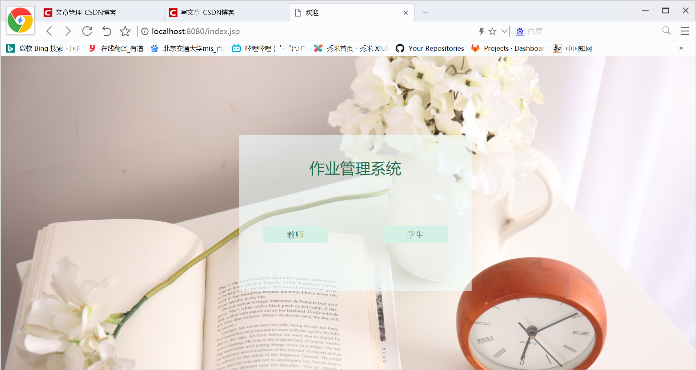
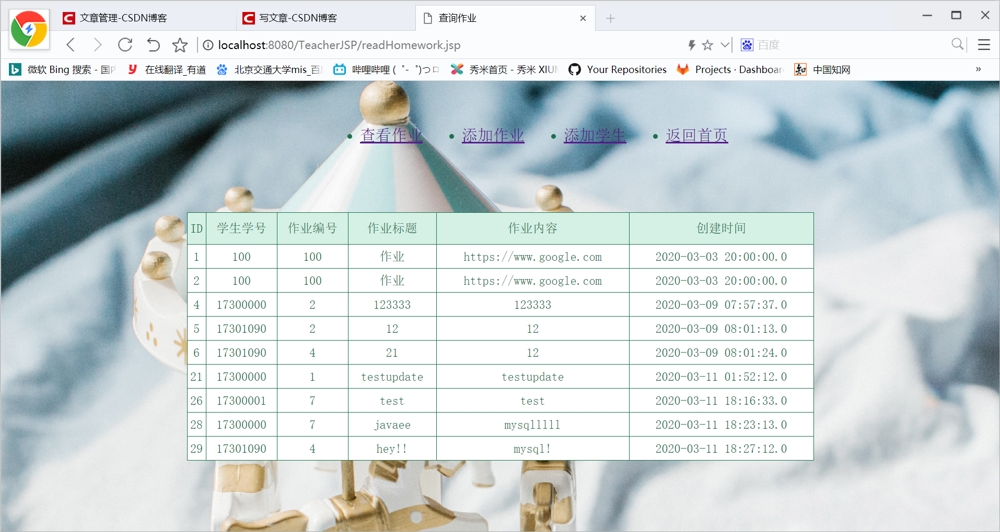
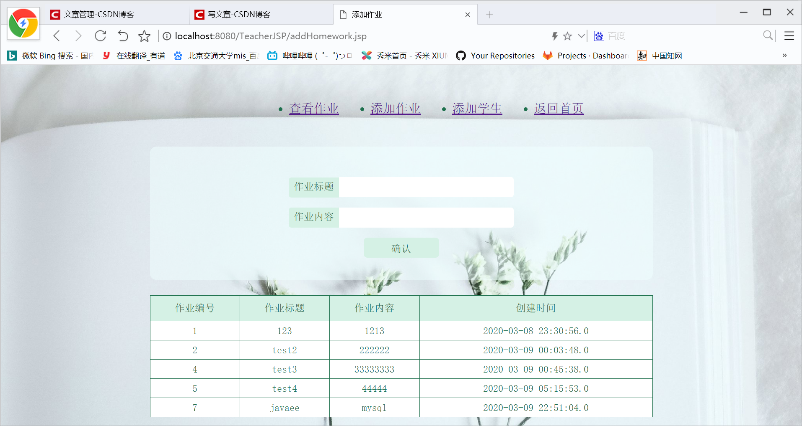
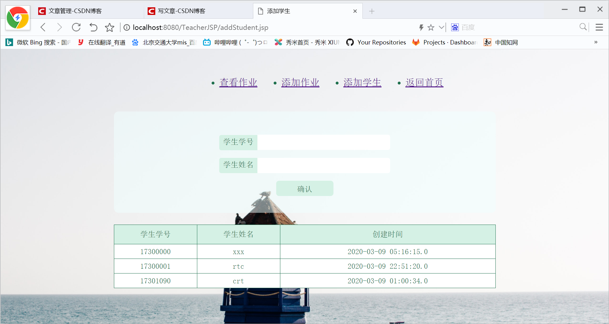
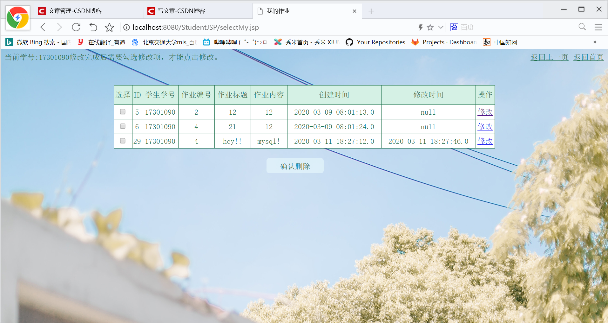
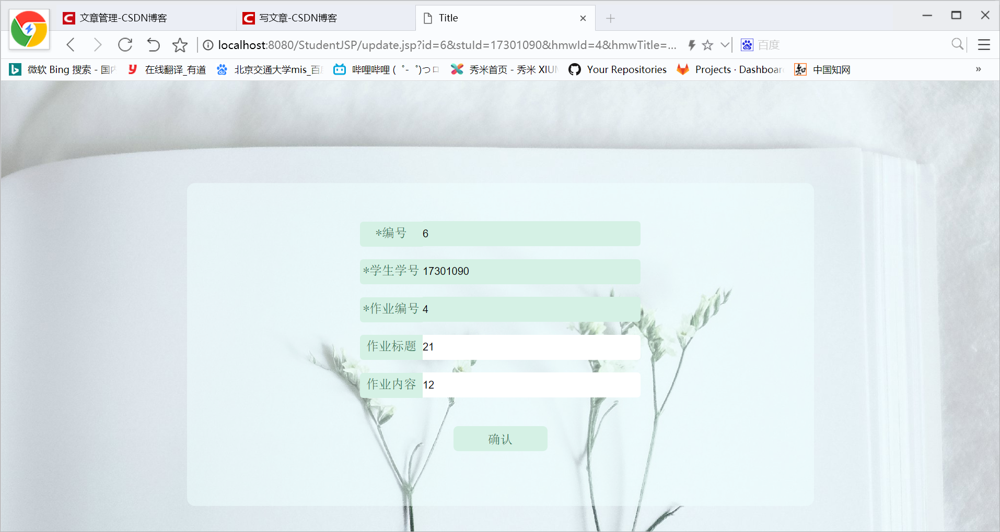
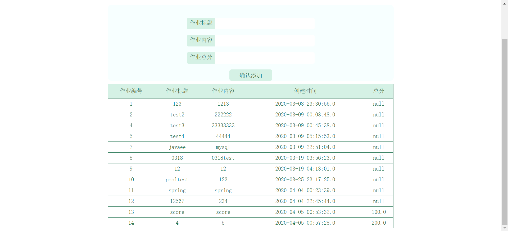
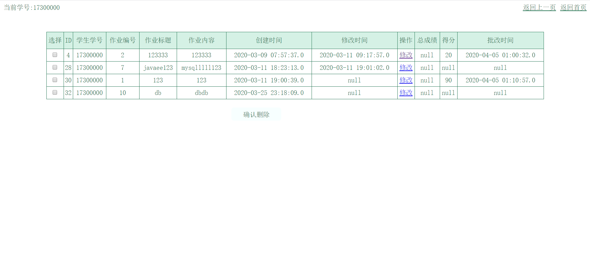
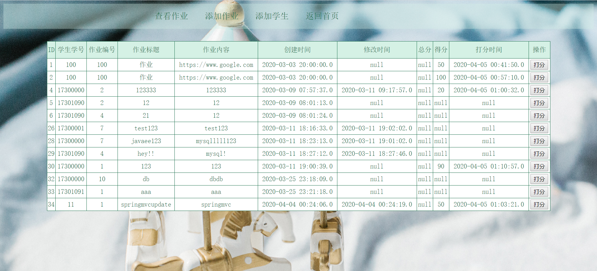
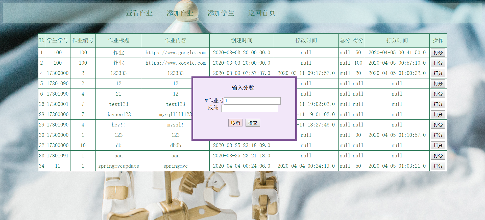

# JavaEE Project/Module模式
## JavaEE-01 HomeworkMangement
运行环境：idea 2019.3.3
Tomecat 9.0.31
mysql：8.0.18
#### 分为教师端和学生端
初始界面
  
#### 教师端：
查询作业：
  
添加作业+查看作业：
  
添加学生+查看学生：
  
#### 学生端：
提交作业：
 
查看作业+批量删除作业：
 
修改作业：
 
 
## JavaEE-01-SpringMVC HomeworkMangement
改造为spring mvc模式\
控制反转是一种通过描述（在 Java 中可以是 XML 或者注解）并通过第三方（Spring）去产生或获取特定对象的方式。\
**好处：**\
降低对象之间的耦合
我们不需要理解一个类的具体实现，只需要知道它有什么用就好了（直接向 IoC 容器拿）\
主动创建的模式中，责任归于开发者，而在被动的模式下，责任归于 IoC 容器，基于这样的被动形式，我们就说对象被控制反转了。（也可以说是反转了控制）
使用Spring IoC管理我们的实例，而不是使用静态类
JDBC操作类注册为bean
### 增加了新功能——教师打分功能
添加作业时也添加作业总分：
 
学生查看成绩：
 
教师查看成绩：
 
教师打分：
 
